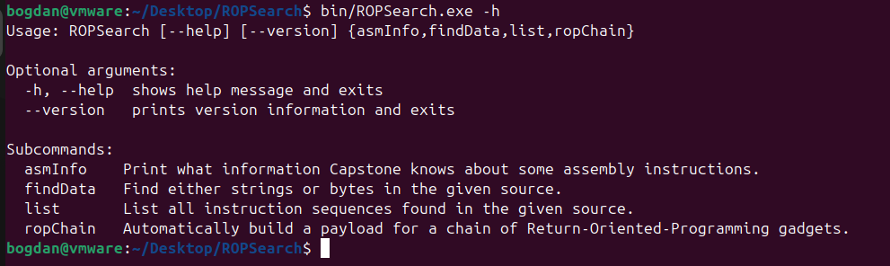
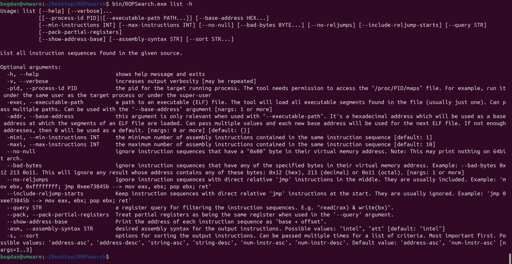
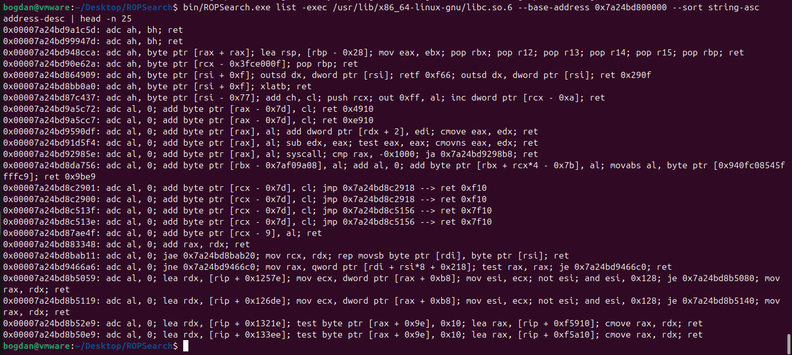
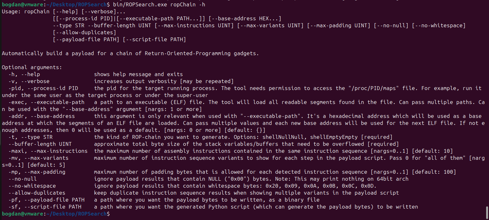
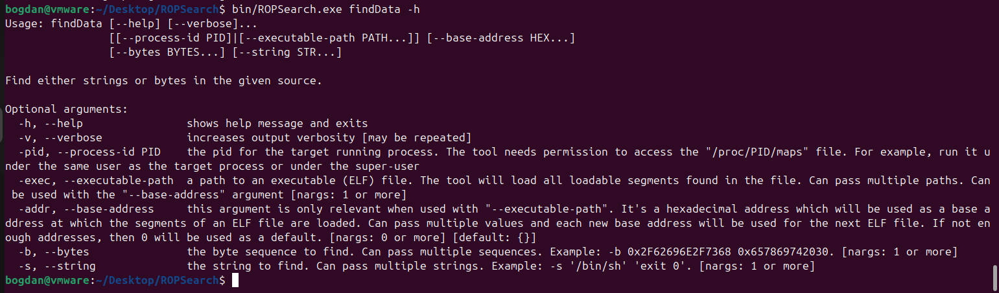
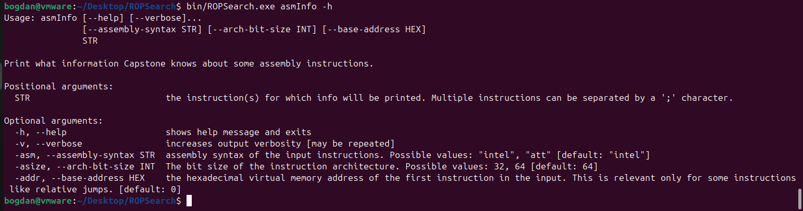

# ROPSearch

ROPSearch is a terminal utility for inspecting binaries/processes in the search for Return-Oriented-Programming gadgets or arbitrary data. It can also perform automatic searches for ROP-chains.
It supports the x86 architecture (32bit/64bit) and ELF executables on Linux.

It makes use of the great [Capstone disassembler](https://github.com/capstone-engine/capstone/) and the [Keystone assembler](https://github.com/keystone-engine/keystone/). For command-line arguments, it uses the handy [argparse for C++](https://github.com/p-ranav/argparse) library.

# "list" command

List all instruction sequences found in the given source.

Sample output:

# "ropChain" command

Automatically build a payload for a chain of Return-Oriented-Programming gadgets.

See [this example Python script](resources/sampleRopChain.py) for a sample output of the automatic ROP-chain finder.

It can be obtained running a command similar to the following, assuming that a suitable "vulnerable32bit.exe" process is running:

`bin/ROPSearch.exe ropChain -pid $(pidof vulnerable32bit.exe) --buffer-length 100 -t shellNullNull --max-variants 5 --script-file resources/sampleRopChain.py --no-null`

Otherwise, you can obtain it directly from an executable file:

`bin/ROPSearch.exe ropChain -exec /usr/lib32/libc.so.6 --base-address eb3b0000 --buffer-length 100 -t shellNullNull --max-variants 5 --script-file resources/sampleRopChain.py --no-null`

# "findData" command

Find either strings or bytes in the given source.

# "asmInfo" command

Print what information Capstone knows about some assembly instructions.

