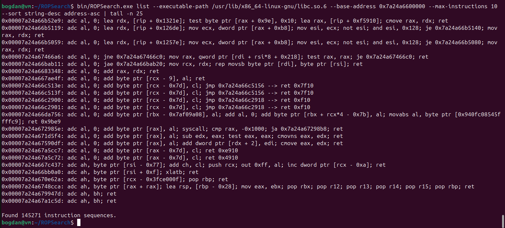

# ROPSearch

ROPSearch is a terminal utility for inspecting binaries/processes in the search for Return-Oriented-Programming gadgets or arbitrary data. It can also perform automatic searches for ROP-chains.
It supports the x86 architecture (32bit/64bit) and ELF executables on Linux.

It makes use of the great [Capstone disassembler](https://github.com/capstone-engine/capstone/) and the [Keystone assembler](https://github.com/keystone-engine/keystone/). For command-line arguments, it uses the handy [argparse for C++](https://github.com/p-ranav/argparse) library.

# Building

After installing the dependencies, you need to run

`make -j22 all`

in order to build the project.

# "list" command

List all instruction sequences found in the given source.

Sample output:

# "ropChain" command

Automatically build a payload for a chain of Return-Oriented-Programming gadgets.

See [this example Python script](resources/sampleRopChain32bit.py) for a sample output of the automatic ROP-chain finder, for **32bit libc**. It was obtained with this command:

`bin/ROPSearch.exe ropChain --executable-path /usr/lib32/libc.so.6 --base-address 0xeb3b0000 --buffer-length 100 --type shellEmptyEmpty --no-null --no-whitespace --max-instructions 5 --max-variants 4 --script-file resources/sampleRopChain32bit.py`

See [this example Python script](resources/sampleRopChain64bit.py) for a sample output of the automatic ROP-chain finder, for **64bit libc**. It was obtained with this command:

`bin/ROPSearch.exe ropChain --executable-path /usr/lib/x86_64-linux-gnu/libc.so.6 --base-address 0x7af6b7400000 --buffer-length 100 --type shellNullNull --no-whitespace --max-instructions 8 --max-variants 5 --script-file resources/sampleRopChain64bit.py`

Otherwise, such a script can be obtained by running a command similar to the following, assuming that a suitable `vulnerable32bit.exe` process is running:

`bin/ROPSearch.exe ropChain --process-id $(pidof vulnerable32bit.exe) --buffer-length 100 --type shellEmptyEmpty --no-null --no-whitespace --max-instructions 5 --max-variants 4 --script-file resources/sampleRopChain32bit.py`

## ROP-chain for spawning a shell

You can use the "ropChain" command to automatically generate and pass the payload to a vulnerable process, spawning a shell. For example, you can try running these commands:
- `mkfifo bin/mypipe`
- `(cat ./bin/mypipe ; cat) | ./bin/vulnerable32bit.exe vulnerable_strcpy`

And then, in another terminal:
- `bin/ROPSearch.exe ropChain -pid $(pidof vulnerable32bit.exe) --type shellEmptyEmpty --buffer-length 100 --no-null --payload-file bin/mypipe`

# "findData" command

Find either strings or bytes in the given source.

# "asmInfo" command

Print what information Capstone knows about some assembly instructions.

